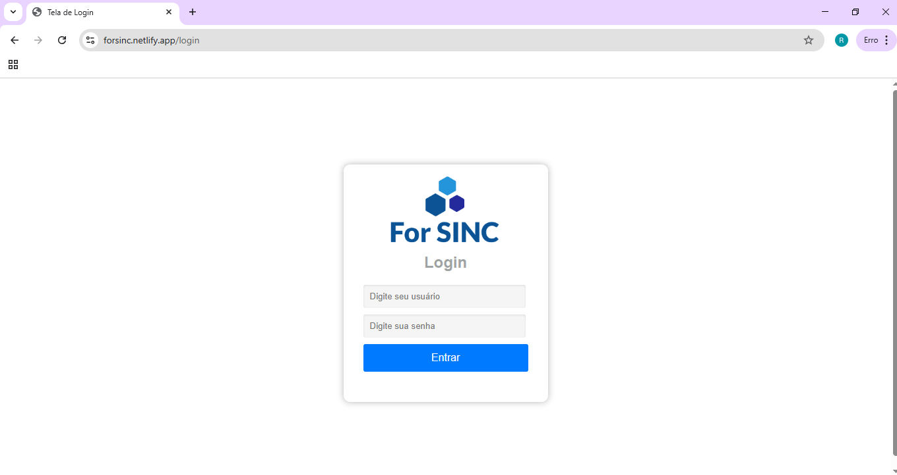
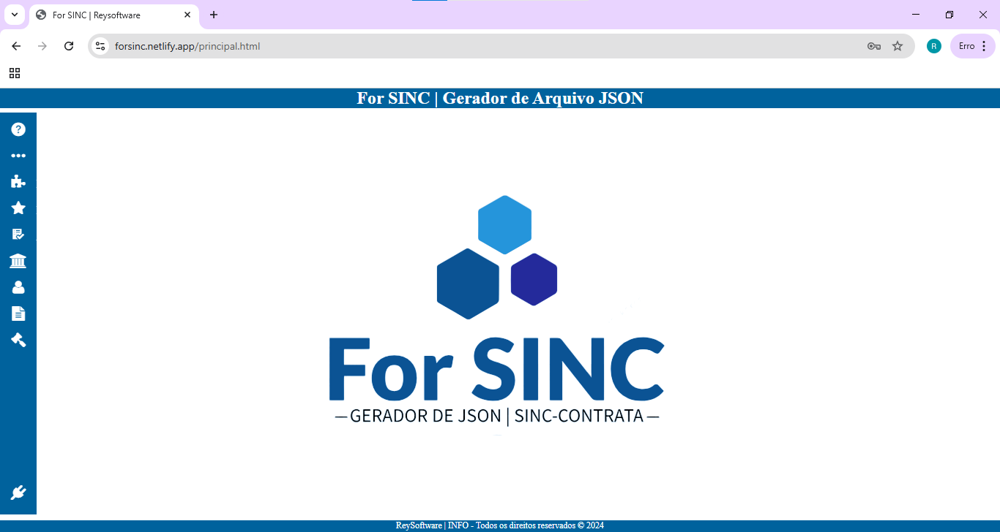
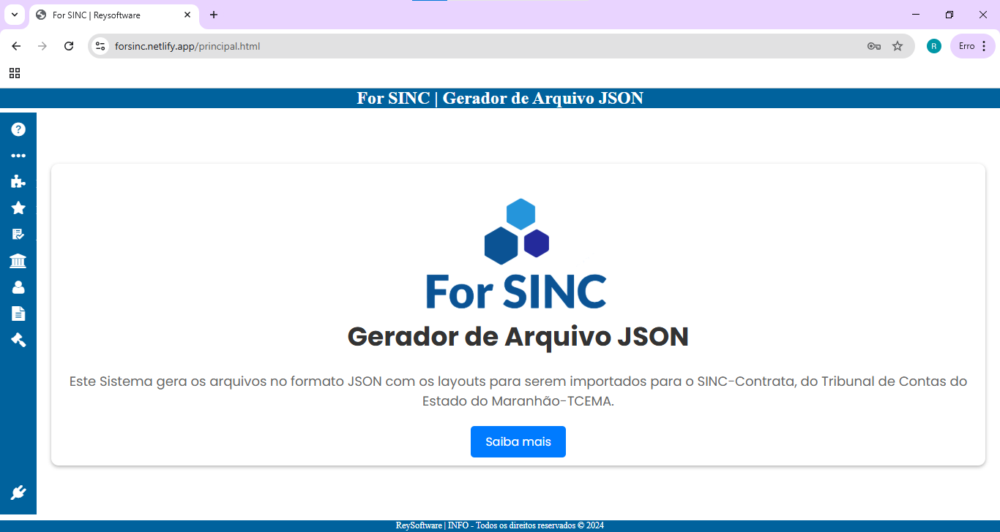
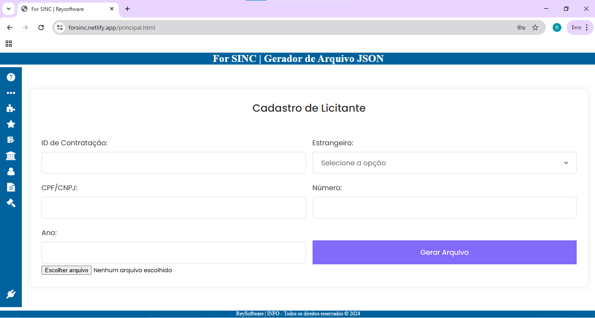
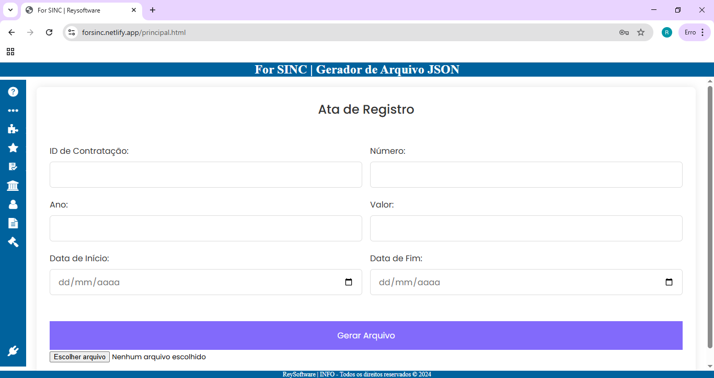

# For SINC - Gerador de Arquivos JSON 

Este projeto trata-se de um gerador de arquivos em formato JSON nos layout's do SINC-Contrata do TCE-MA. Ao digitar as informações, o usário gera os arquivos em formato JSON, e em seguida faz o upload no sistema SINC-Contrata do TCE-MA.  

## 🚀 Começando

Obtenha uma cópia do projeto em operação na sua máquina local para fins de desenvolvimento e teste.

Consulte **(https://github.com/ReiBrito/ForSinc.git)** para saber como implantar o projeto.

## ⚙️ Executando os testes

Click no link **(https://forsinc.netlify.app/)** para testar o o sistema on line.

* Usuário: admin
* Senha: 123

## 🛠️ Construído com

* Html;
* CSS;
* JavaScript.

## 🖼️ Imagens

* Tela de Login
  

* Tela Inicial
  

* Sobre
  

* Cadastro do Licitante
  

* Ata de Registro
  

## ✒️ Autor

* **Reinaldo Brito** - *Trabalho Inicial* - [desenvolvedor](https://github.com/ReiBrito)

## 📄 Licença

Este projeto está sob a licença (sua licença) - veja o arquivo [LICENSE](https://github.com/ReiBrito/ForSinc/blob/main/LICENSE) para detalhes.

